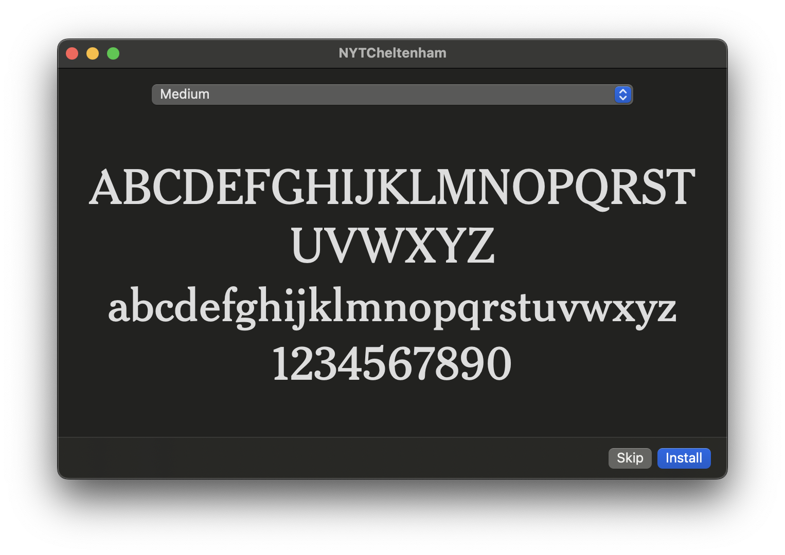
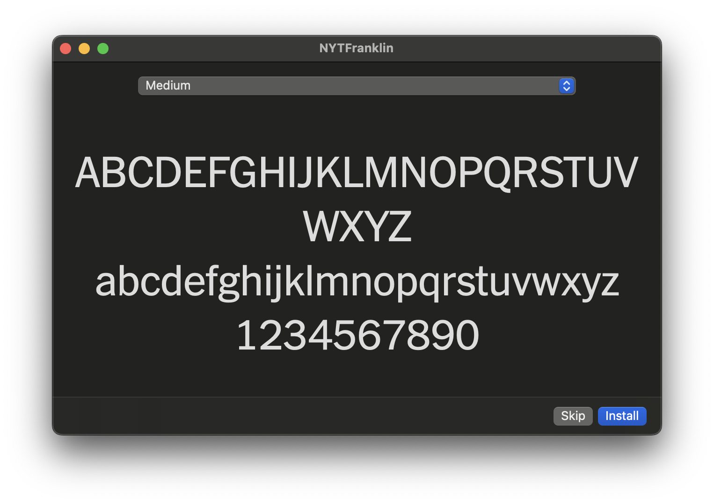
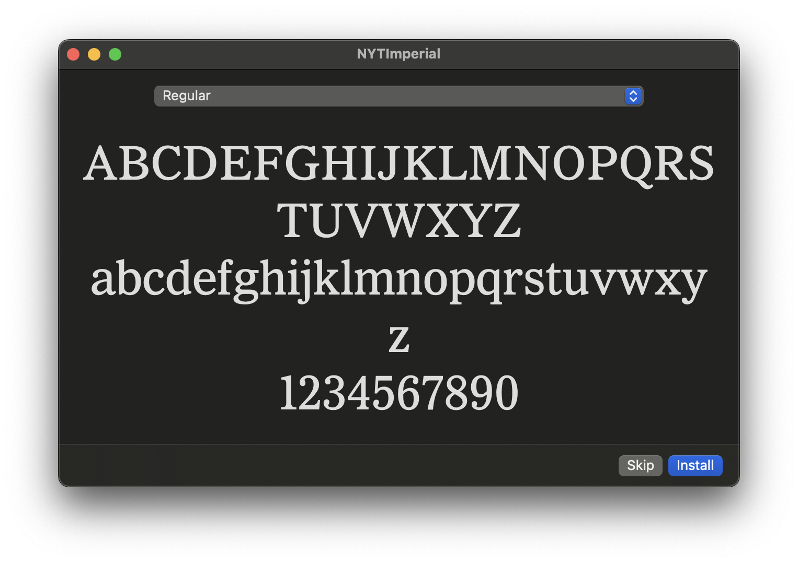
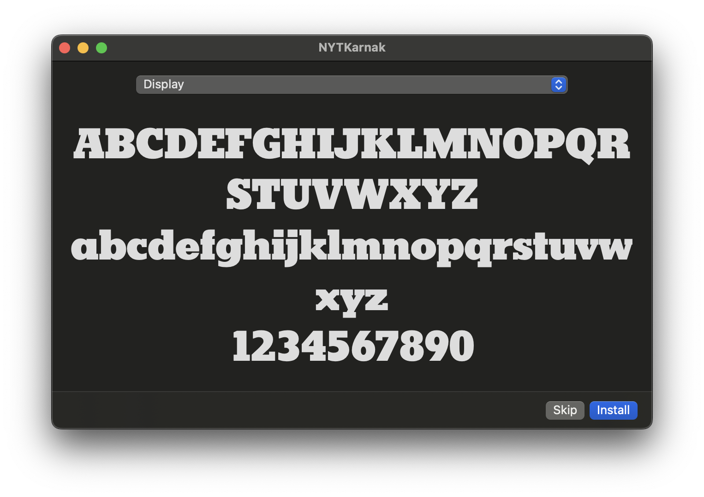
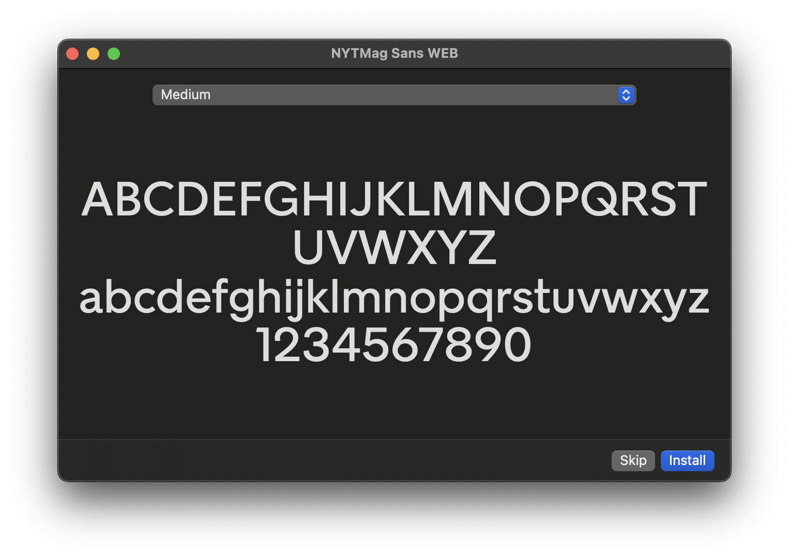
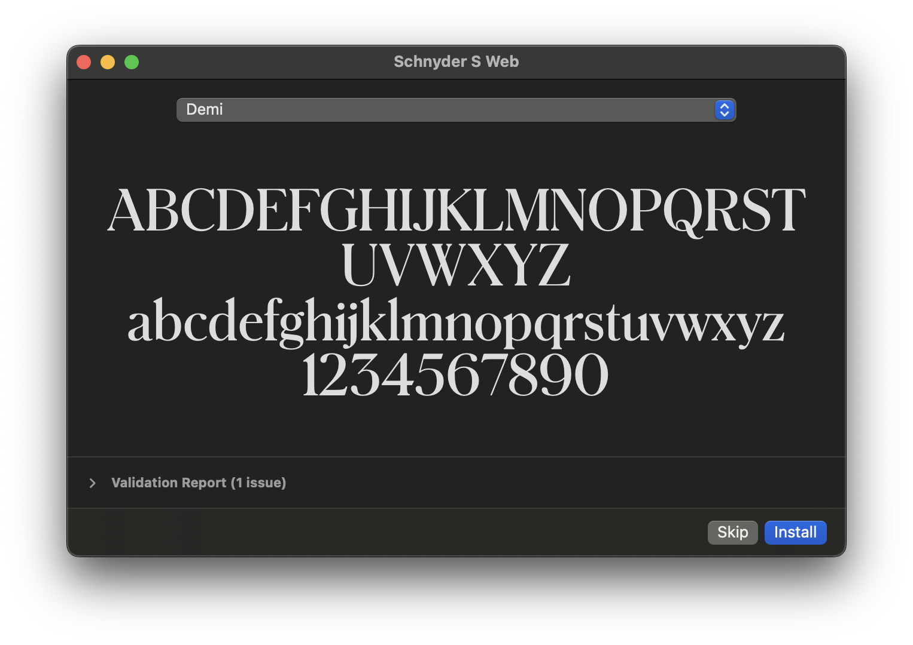
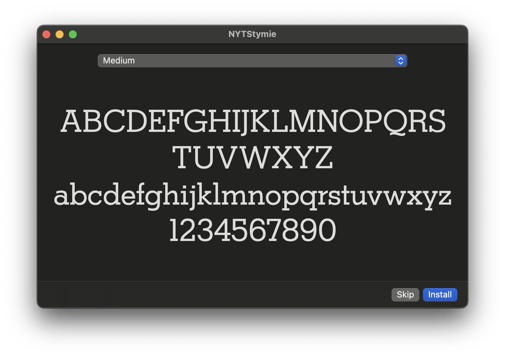

# 🍺 homebrew-nyt-fonts

Homebrew tap containing a collection of fonts used in the New York Times.

For a font inspired by the New York Times masthead, see [the Chomsky font](https://github.com/ctrlcctrlv/chomsky), designed by Fredrick Brennan (installable using `brew install font-chomsky`).

## Usage

Tap this repository to install the available fonts:

```sh
brew tap martimlobao/nyt-fonts
brew install font-cheltenham
brew install font-franklin
brew install font-imperial
brew install font-karnak
brew install font-mag
brew install font-schnyder
brew install font-stymie
```

## Preview









## Thanks

Thanks to [@FrancesCoronel](https://github.com/FrancesCoronel) who compiled the [original repository](https://github.com/FrancesCoronel/nyt-comm).
